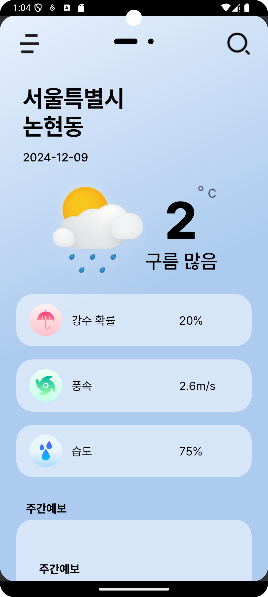
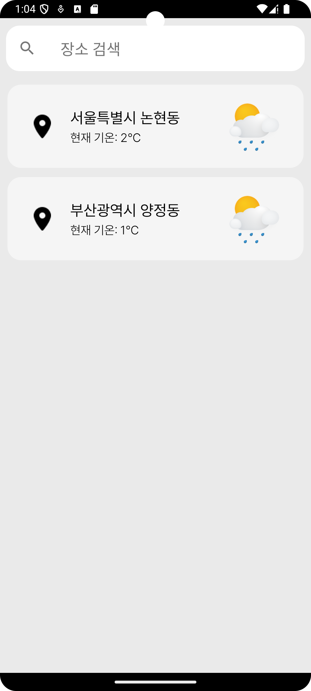

# 🌦️ **Weathery**
**Your Personal Weather Companion**

Weathery는 사용자가 관심 있는 지역의 날씨를 간편하게 확인하고 관리할 수 있는 안드로이드 앱입니다.  
🌍 **현재 위치** 기반 날씨와 📍 **추가한 도시**의 정보를 깔끔한 UI로 제공합니다.

---

## 📋 **Features**
### ✅ **현재 구현된 기능**
- **현재 위치 기반 날씨 조회**: 사용자의 위치를 자동으로 감지해 날씨 정보를 제공합니다.
- **다중 도시 관리**: 검색을 통해 여러 도시를 추가하고, 페이지 간 스와이프를 통해 날씨를 확인할 수 있습니다.
- **로컬 데이터 저장**: Room DB를 활용해 사용자가 추가한 도시 정보를 저장합니다.
- **구글 지도 연동**: 도시 검색 시 Google Maps API를 통해 지도와 연동됩니다.
- **날씨 데이터 API 연동**: Retrofit을 사용해 공공 데이터 API로부터 실시간 날씨 정보를 가져옵니다.

### 🛠️ **예정 기능**
- **날씨 아이콘 및 주간 예보**: 날씨 상태에 따라 아이콘을 변경하고 주간 예보 기능을 추가할 예정입니다.
- **도시 수정 및 삭제 기능**: 사용자가 추가한 도시를 수정 및 삭제할 수 있는 기능 구현.
- **오프라인 모드**: 캐시를 활용해 네트워크 연결이 없을 때도 날씨 데이터를 확인할 수 있습니다.
- **Compose로 UI 리팩토링**: Jetpack Compose를 도입해 더 유연하고 현대적인 UI 구성 예정.
- **MVVM 아키텍처 도입**: 구조적 확장성과 유지보수성을 높이기 위한 아키텍처 리팩토링 예정.

---

## 🛣️ **Roadmap**

### **1️⃣ 기본 기능**
- [x] ViewPager2를 활용한 다중 화면 구성
- [x] 현재 위치 및 도시 추가 기능 구현
- [x] Room DB와 Retrofit을 활용해 날씨 데이터 관리
- [x] Drawer Layout에서 도시 리스트 제거 및 검색 화면 분리

### **2️⃣ 날씨 정보 개선**
- [ ] 날씨 상태에 따른 아이콘 변경
- [ ] 주간 날씨 예보 UI 추가

### **3️⃣ 데이터 관리**
- [ ] 캐시 데이터를 활용한 오프라인 모드 지원

### **4️⃣ 리팩토링 및 최적화**
- [ ] Jetpack Compose로 UI 리팩토링
- [ ] MVVM 아키텍처 도입
- [ ] 성능 최적화 및 테스트

---

## 🛠️ **Tech Stack**
- **언어**: Kotlin
- **아키텍처**: (현재는 기존 방식 사용, MVVM으로 추후 리팩토링 예정)
- **라이브러리 및 프레임워크**:
  - UI: ViewPager2, Navigation Component, Material Design, DrawerLayout
  - 지도: Google Maps API, Google Places API
  - 네트워킹: Retrofit, Gson Converter
  - 로컬 데이터: Room
  - 디자인 요소: DotsIndicator (페이지 Indicator)
- **버전 관리**: Git, GitHub

---

## 📷 **Screenshots**
### 메인 화면

### 검색 화면

---
